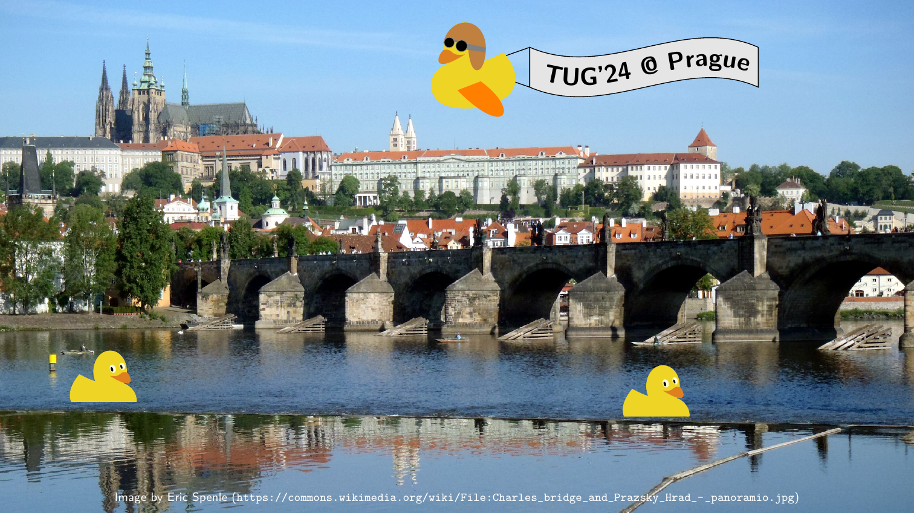
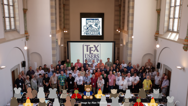
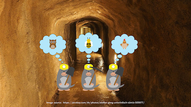
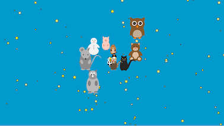
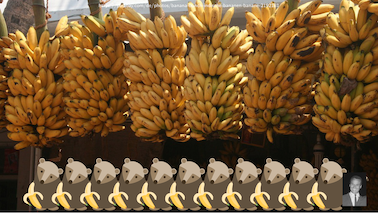
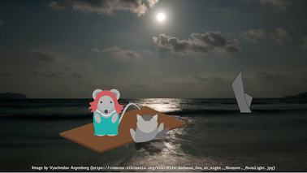
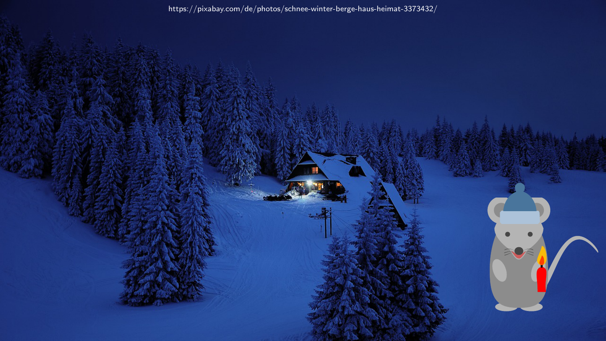

# The Great TikZlings Christmas Extravaganza 2023

This repository contains the souce code of the Great TikZlings Extravanganza 2023, created by ...

The full video is available from ...

## 1. Napoleon

- Music: Sauron's March - Lord Of Mordor 0:50 - 1:10
  https://www.youtube.com/watch?v=P3bQ7wL1f0o
  
- Background: Jamie - Fontainebleau Castle
  https://commons.wikimedia.org/wiki/File:Fontainebleau_Castle_(2735351636).jpg

- Source Code: [./samcarter/Napoleon/](https://github.com/TikZlings/Extravaganza2023/tree/main/samcarter/Napoleon)

## 2. King Charles

- Music: Land of Hope and Glory - BBC Proms 2014 5:00 - 5:22
  https://www.youtube.com/watch?v=R2-43p3GVTQ
  
- Background: Trooping the Colour 2023 - Free Tours by Foot London 
  https://www.youtube.com/watch?v=AMD2gO9_Sqo

- Source Code: [./samcarter/KingCharles/](https://github.com/TikZlings/Extravaganza2023/tree/main/samcarter/KingCharles)

## 3. Commercial Break Companion

- Music: Richard Strauss Also sprach Zarathustra, Herbert von Karajan 1:00 - 1:25 
  https://www.youtube.com/watch?v=h3eEHZCahVU

- Source Code: [./ulrike/commercialbreak/](https://github.com/TikZlings/Extravaganza2023/tree/main/ulrike/commercialbreak)

## 4. TUG'24 at Prague

- Music: The Moldau - Smetana (NATURE & CLASSICS) - Orchestral Classical Music You Must Hear 1:49 - 2:06
  https://www.youtube.com/watch?v=bWcoNzKRnrw
  
- Background: Eric Spenle - Charles bridge and Prazsky Hrad
  https://commons.wikimedia.org/wiki/File:Charles_bridge_and_Prazsky_Hrad_-_panoramio.jpg  

- Source Code: [./samcarter/Prague/](https://github.com/TikZlings/Extravaganza2023/tree/main/samcarter/Prague)

## 5. Church of TeX

- Music: O Come, All Ye Faithful (Adeste Fideles) at Westminster Abbey 0:23 - 0:43
  https://www.youtube.com/watch?v=l1wHyMR_SCA
  
- Source Code: [./ulrike/churchoftex/](https://github.com/TikZlings/Extravaganza2023/tree/main/ulrike/churchoftex)

## 6. Believers

- Music: ABBA I Have A Dream 0:32 - 0:50 - 1:00
  https://www.youtube.com/watch?v=nrmhAvwBfig
  
- Background: https://pixabay.com/de/photos/stollen-gang-unterirdisch-säntis-505977/

- Source Code: [./carlatex/Believers/](https://github.com/TikZlings/Extravaganza2023/tree/main/carlatex/Believers)

## 7. Finale

- Music: O Come, All Ye Faithful (Adeste Fideles) at Westminster Abbey 0:30 - 0:50
  https://www.youtube.com/watch?v=7r3VVMUhAxU
  
- Source Code: [./ulrike/finale/](https://github.com/TikZlings/Extravaganza2023/tree/main/ulrike/finale)

## 8. Belafonte

- Music: Harry Belafonte The Banana Boat Song 1956 0:52 - 1:15
  https://www.youtube.com/watch?v=d-Bwc0wcIKA
  
- Background: https://pixabay.com/de/photos/banana-bunch-indische-bananen-banane-2192181/
  
- Source Code: [./ulrike/belafonte/](https://github.com/TikZlings/Extravaganza2023/tree/main/ulrike/belafonte)

## 9. Titanic

- Music: Titanic • My Heart Will Go On • Celine Dion 3:25 - 3.40
  https://www.youtube.com/watch?v=F2RnxZnubCM
  
- Background: Vyacheslav Argenberg -- Shaheed Dweep, Neil Island, Andaman and Nicobar Islands, Indian Ocean.
  https://commons.wikimedia.org/wiki/File:Andaman_Sea_at_night,_Moonset,_Moonlight.jpg

- Source Code: [./samcarter/Titanic/](https://github.com/TikZlings/Extravaganza2023/tree/main/samcarter/Titanic)

## 10. Silent Night

- Music: Margret Almer - Stille Nacht heilige Nacht Jodel Version 1997 0:18 - 0:35
  https://www.youtube.com/watch?v=G5wpQbTU1Ck
  
- Background: https://pixabay.com/de/photos/schnee-winter-berge-haus-heimat-3373432/
  
- Source Code: [./ulrike/silentnight/](https://github.com/TikZlings/Extravaganza2023/tree/main/ulrike/silentnight)
